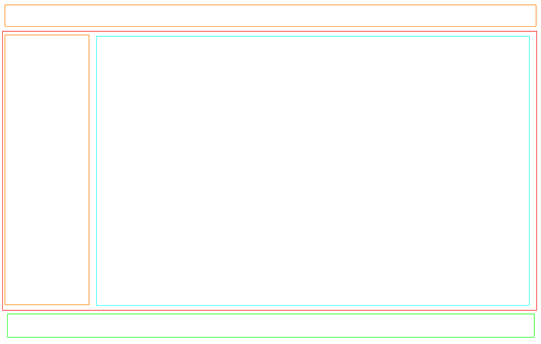
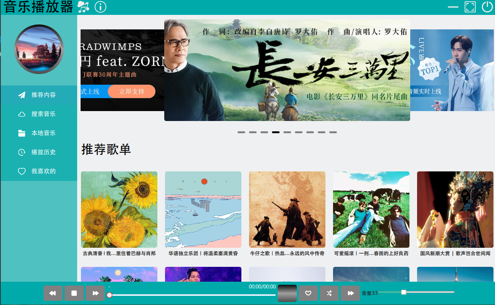
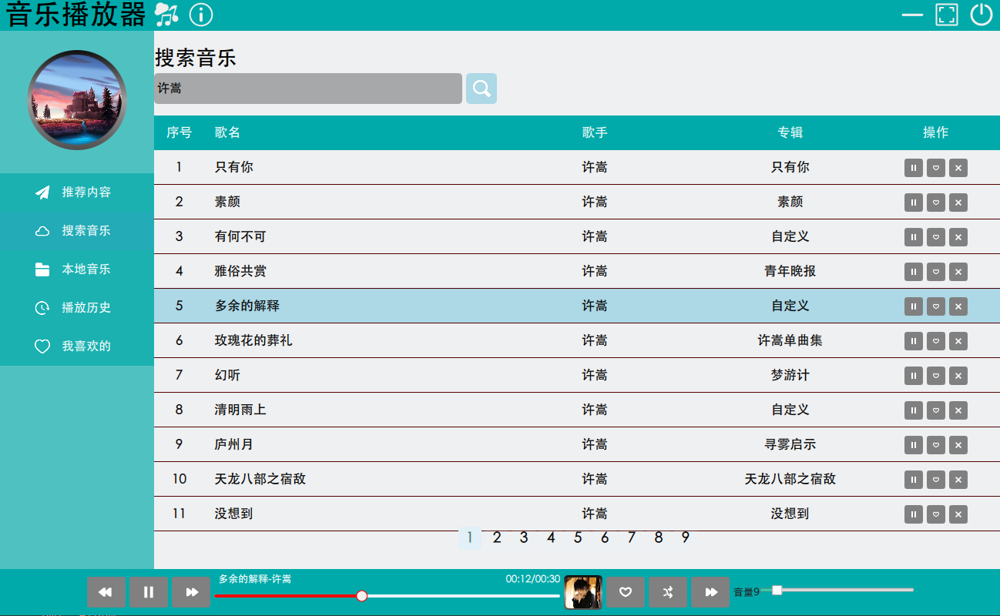
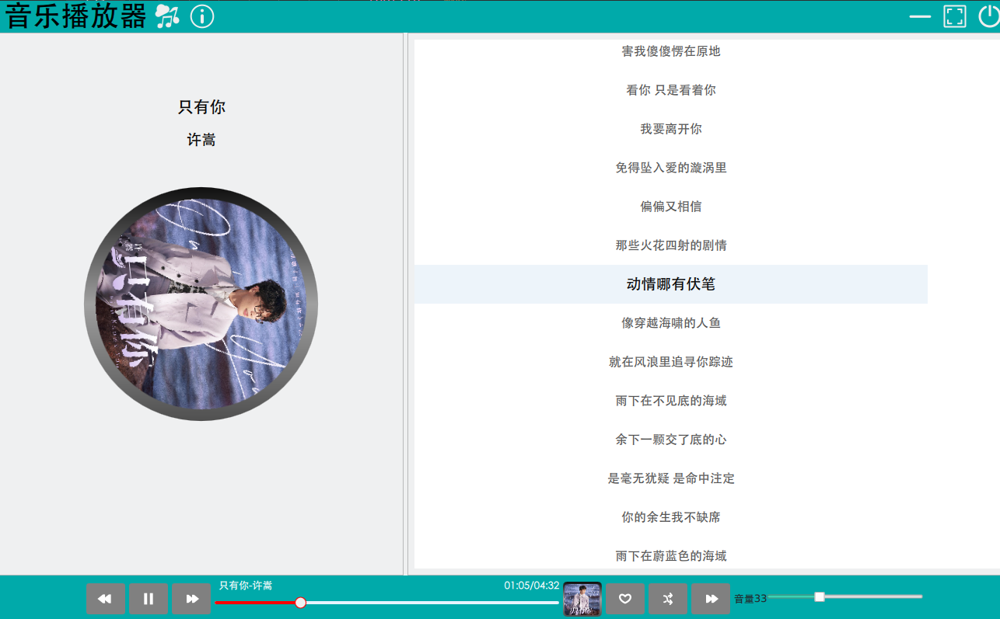

##  项目介绍

###  项目介绍
#### 主体布局

#### 主界面

#### 搜索界面

#### 歌词界面

- 使用Qt Quick QML开发的一款云音乐播放器程序

- 实现了推荐内容、搜索音乐、播放音乐、历史记录、我喜欢等功能

- 运用了RowLayout、ColumnLayout、Grid等布局

- 使用了ListView进行列表展示、歌词滚动
- 使用MediaPlayer实现媒体播放
- 使用Settings实现历史记录、我喜欢等数据存储(有点问题)
- 有部分自定义组件
- 使用了系统托盘图标功能

- 网络请求中使用了C++与qml交互

- 会用到一点前端的JavaScript相关知识

- 用到了Docker容器运行搜索服务程序，一些基础的Docker操作

###  docker安装
- docker命令：
- 安装：
- yay -Sy docker
- 启动：
- sudo systemctl start docekr
- sudo systemctl status docekr
- docker pull binaryify/netease_cloud_music_api
- docker run -d -p 3000:3000  --name music binaryify/netease_cloud_music_api
